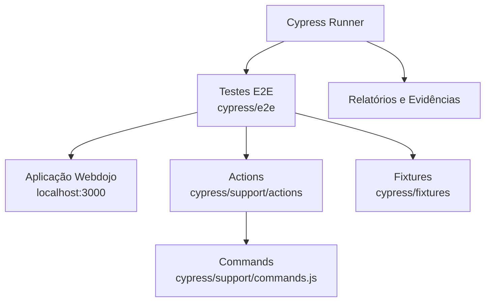
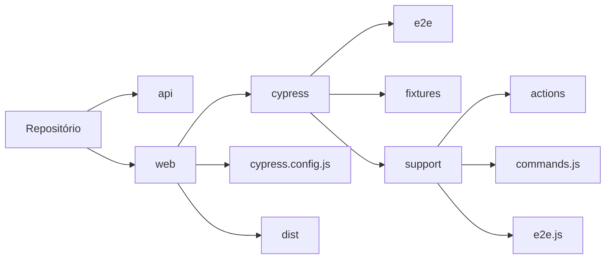
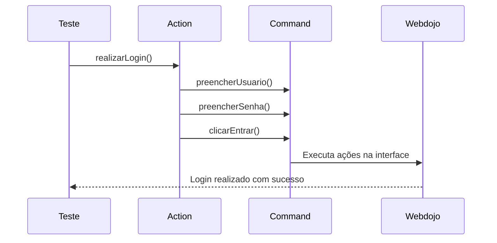

# 🏗 Arquitetura da Automação

O projeto segue uma arquitetura organizada em camadas para facilitar manutenção, reutilização de código e escalabilidade dos testes automatizados.



## Fluxo de Execução

1. A aplicação Webdojo é iniciada através do comando:

```bash
npm run dev
```

2. O Cypress é executado através dos scripts definidos no projeto.

3. Os testes localizados em:

```text
cypress/e2e
```

executam os cenários automatizados.

4. Os cenários utilizam:

* Fixtures para massa de dados
* Actions para centralização de regras de negócio
* Commands para comandos customizados

5. Durante a execução, o Cypress interage com a aplicação Webdojo e valida os comportamentos esperados.

---

## Arquitetura Física do Repositório



---

## Padrão Arquitetural Utilizado

O projeto utiliza uma abordagem inspirada no padrão:

### Action Layer Pattern

```text
Teste
 ↓
Action
 ↓
Command
 ↓
Elemento da Interface
```

### Benefícios

* Menor duplicação de código
* Facilidade de manutenção
* Melhor legibilidade dos testes
* Reutilização de ações comuns
* Escalabilidade para novos cenários

---

## Exemplo de Fluxo de Login


